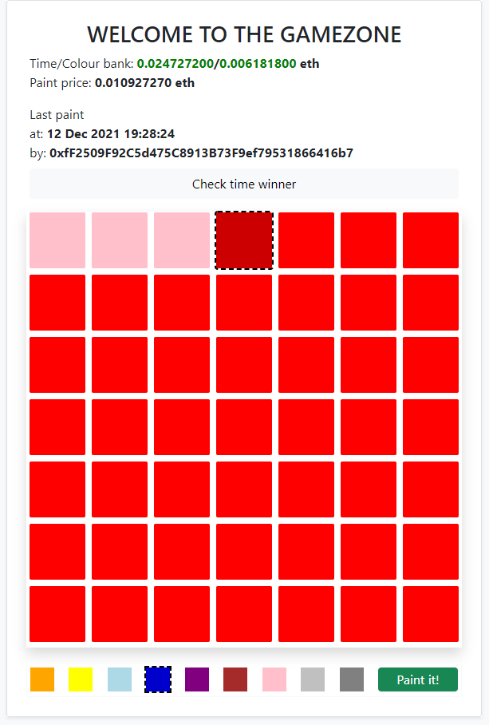

# last-pixel
*On-chain last-pixel browser game*



## Installation
```console
cd web
python3 -m pip install -r requirements.txt
```
## Local run
🔴 **Only for test purposes!** 🔴  
⚠️ **Python ver greater or equal to 3.10 is not supported!** ⚠️
```console
python3 manage.py runserver
```
## (Optinal) Smart-contract deployment
```console
See later
```
Do not forget to change network name at `web/game_site/eth.py` after that.